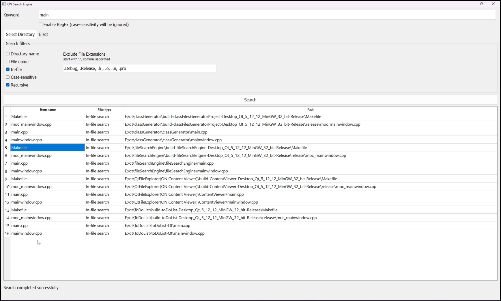

# File Search Engine

## Features
Search for a keyword in:
- Directory names
- File names
- In-file text

You can include/exclude specific file-extensions in/from searching, supported file extensions:
- headerfiles (.h)
- C/C++ files (.c/cpp)
- Python files (.py)
- Text files (.txt)

You can search using regular expressions (RegEx)

## Framework
- Qt 5 with C++17

## Project walkthrough playlist on YouTube [AR]
https://youtube.com/playlist?list=PL7u1Nrc5ibNJeQQ8Eb7L2vqT5iCRbW8K-&si=Nec7CPFVi_OHkydx

## UI

## Future work
- Add filters to exclude specific file-extensions [DONE]
- Add filters to exclude specific sub-folders
